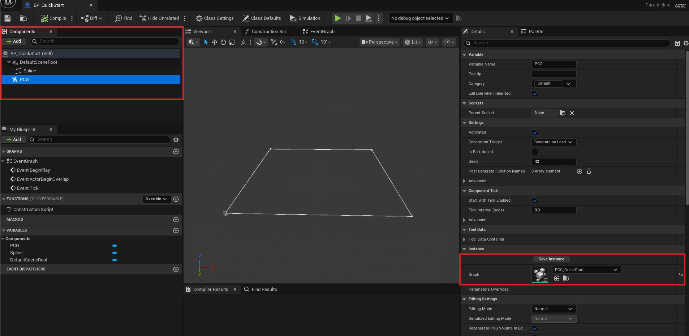
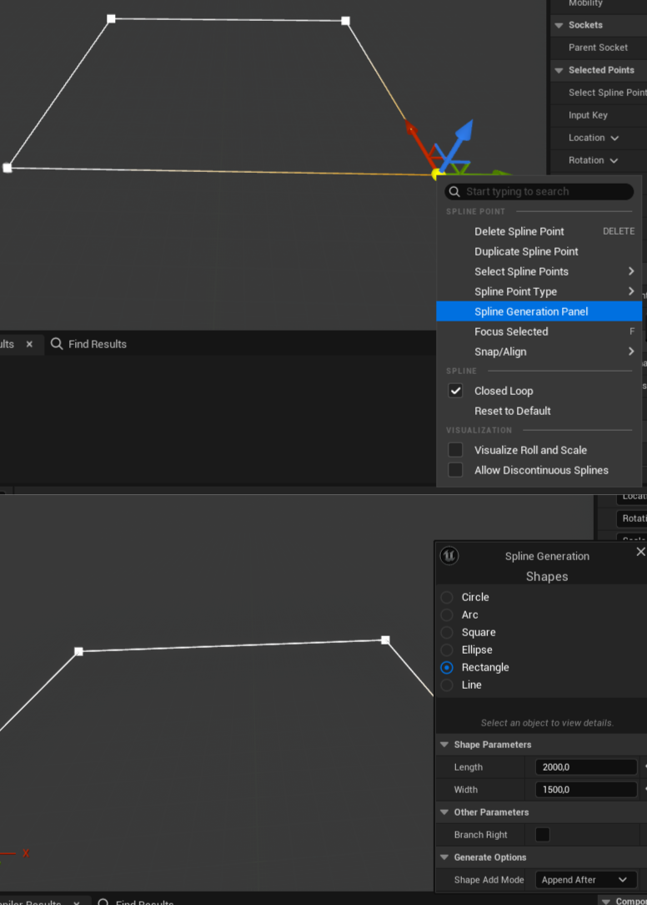
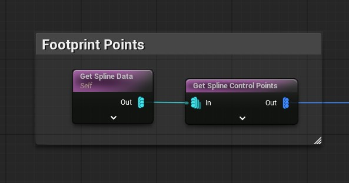
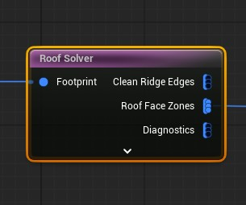
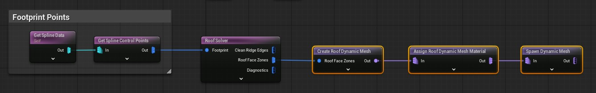
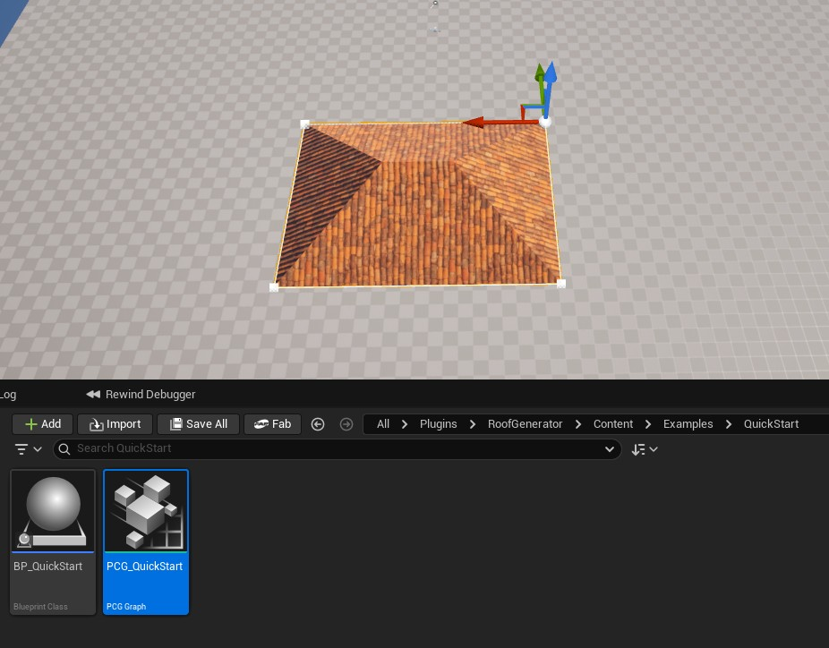

# Getting Started

This quick start builds a simple procedural hip roof from a Blueprint spline and a PCG graph.

Video tutorial: [Watch the quick-start video on YouTube](https://www.youtube.com/watch?v=C5bTfa2KcG8)

## Requirements

- Unreal Engine 5.7 or later.
- RoofGenerator plugin enabled.
- PCG, Geometry Scripting, and PCG Geometry Script Interop enabled.

Restart the editor if Unreal asks you to after enabling plugins.

## 1. Create The Tutorial Assets

1. Create a Blueprint Actor and name it `BP_Tutorial`.
2. Create a PCG Graph and name it `PCG_Tutorial`.
3. Open `BP_Tutorial`.
4. Add a `Spline` component.
5. Add a `PCG` component.
6. Select the `PCG` component and assign `PCG_Tutorial` as its graph.



## 2. Create A Footprint Spline

1. Select the `Spline` component in `BP_Tutorial`.
2. Create a simple closed building footprint.
3. For a fast test, use the spline editing tools (Spline generator tool) to make a rectangular or L-shaped footprint.
4. Keep the points ordered around the perimeter and avoid self-intersections.

This Blueprint/PCG setup only needs to be created once. After that, move, add, or remove spline points in the viewport and the roof will regenerate from the updated footprint.



## 3. Read The Spline In PCG

Open `PCG_Tutorial` and add these nodes:

1. `Get Spline Data`
2. `Get Spline Control Points`

Connect:

```text
Get Spline Data -> Get Spline Control Points
```

This converts the Blueprint spline into ordered footprint points for the roof solver.



## 4. Solve The Roof

Add the `Roof Solver` node.

Connect:

```text
Get Spline Control Points -> Roof Solver
```

Select `Roof Solver` and set the roof pitch if needed. A value around `30` degrees is a good first test.

The `Roof Solver` outputs roof face zones, ridge/hip/valley data, and diagnostics used by the other RoofGenerator nodes.



## 5. Create And Spawn The Roof Mesh

Add these nodes:

1. `Create Roof Dynamic Mesh`
2. `Assign Roof Dynamic Mesh Material`
3. `Spawn Dynamic Mesh`

Connect:

```text
Roof Solver: RoofFaceZones -> Create Roof Dynamic Mesh
Create Roof Dynamic Mesh -> Assign Roof Dynamic Mesh Material
Assign Roof Dynamic Mesh Material -> Spawn Dynamic Mesh
```

Select `Assign Roof Dynamic Mesh Material` and choose a roof material. You can use one of the included material instances or your own material.



## 6. Generate The Result

1. Place `BP_Tutorial` in the level.
2. Select the actor or its `PCG` component.
3. Click `Generate` if the graph does not update automatically.

You should now see a generated roof mesh following the spline footprint.



## Optional Nodes

After the basic roof is working, you can extend the graph with:

- `Footprint Offset Points` to expand or inset the footprint.
- `Extract Roof Ridge Edges` to output ridge edge point pairs and optional splines.
- `Sample Roof Surface Points` to place objects on roof surfaces.
- `Create Roof Gutter Splines` to generate gutter and downspout splines.
- `Create Segment Splines From Points` to turn point pairs into spline segments.

## Example Content

The plugin includes an example PCG house setup and map that you can use as a reference:

- `Content/Examples/PCGHouse/BP_House`
- `Content/Examples/PCGHouse/PCG_House`
- `Content/Levels/TheHouse`

Use the example content to compare node wiring, materials, and generated results.

## Troubleshooting

- If no roof appears, confirm `BP_Tutorial` has both a `Spline` component and a `PCG` component.
- If the graph has no spline data, confirm `PCG_Tutorial` is assigned on the `PCG` component.
- If the roof shape looks wrong, check that the spline footprint is closed, and not self-intersecting.
- If the roof has the default material, select `Assign Roof Dynamic Mesh Material` and set a roof material.
- If the graph does not update, select the PCG component and run `Generate`.
